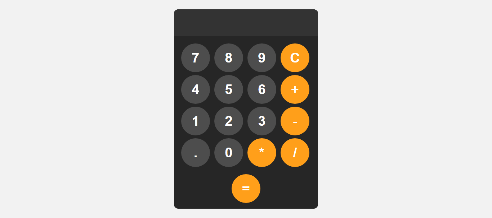

# Simple Calculator App

A responsive calculator built using **HTML**, **CSS**, and **JavaScript**.

## 🔢 Features

- Basic arithmetic operations (+, -, *, /)
- Responsive layout centered on screen
- Button hover and click effects
- Error handling for invalid calculations

## 💻 Technologies Used

- HTML5
- CSS3 (Flexbox + Grid)
- JavaScript (DOM manipulation)

## 🖼️ Preview

 

## 🚀 Getting Started

To run this project locally:

1. Clone the repository:

   ```bash
   git clone https://github.com/yourusername/simple-html-css-js-calculator.git
